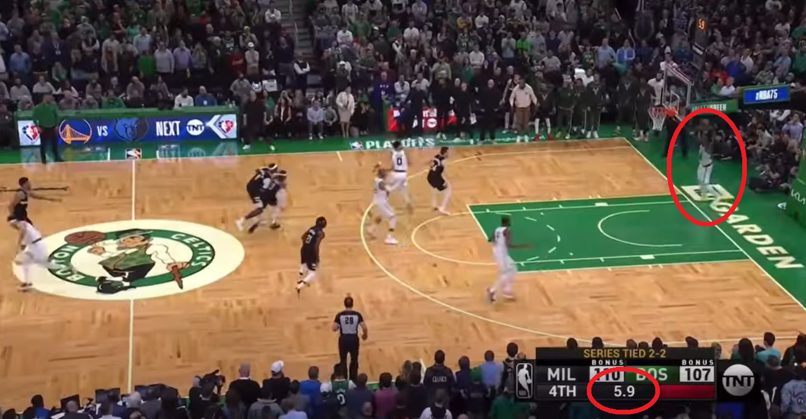
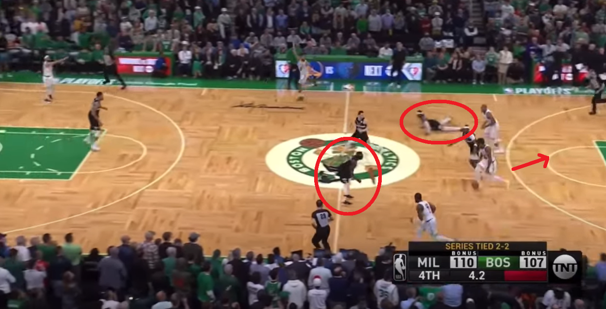

```{r setup, include=FALSE}
knitr::opts_chunk$set(echo = FALSE)
```
The Celtic's Marcus Smart has not always shone through as the highest basketball IQ player in the league. Some years ago, Shaquille O'Neal, in his infamous Shaqtin' a fool series, devoted an entire montage to his flopping antics. Our personal favourite is the Isiah Thomas piggyback:

<iframe width="560" height="315" src="https://www.youtube.com/embed/OLA51MMbROQ" title="YouTube video player" frameborder="0" allow="accelerometer; autoplay; clipboard-write; encrypted-media; gyroscope; picture-in-picture" allowfullscreen></iframe>

In game 5 against the Bucks, he nearly single handedly ended the Celtics run to the NBA finals. With Boston leading by a single point in this seemingly crucial game, Smart proceeded to turn an easy defensive rebound into a turnover, had a lay up blocked and dribbled right into a Milwaukee trap, handing them the ball in what was the game's final action. All of this is even more impressive given that it was achieved within the final 14.2 seconds. 

<iframe width="560" height="315" src="https://www.youtube.com/embed/8zK6La4g8sU" title="YouTube video player" frameborder="0" allow="accelerometer; autoplay; clipboard-write; encrypted-media; gyroscope; picture-in-picture" allowfullscreen></iframe>

The final play in particular could easily have been avoided - spot the trap, retreat dribble to create space and change the angle of attack via a pass to the weak side. When Smart inbounded the ball, there was 5.9 seconds on the clock - roughly translating to 6 dribbles before time expires. However, when he turned it over, Smart had only taken 3 dribbles but had continued to rush head first into a trap. 





And just like that, a slim Celtics lead, became a definite loss and the need for a game 7 if they were to progress.

Sure Smart has made some mistakes and it cost them. But maybe the important take away is this: _the Celtics won the series_. Maybe not despite Smart but because of him. To see his impact we need to go all the way back to the start of the season.

# Smart's Season Story

After an unimpressive start, the Celtics welcomed Chicago on November the first. The Bulls' record of 6 and 1 stood in stark contrast to the Celtics abysmal 2 and 5. A 14 point lead was blown and Smart had had enough. After the game, he criticized what is so often a feature of NBA play - lone rangers failing to pass. Tatum and Brown in particular came in for scrutiny, with Smart remarking "They don't want to pass the ball". 

Fast forward a few months and Smart has noticed something. He remarked "...a change was starting" and the Celtics fortunes were certainly looking up. Take a look at their running win percentage. The first vertical line is placed when Smart called out Brown and Tatum. The second is after their locker room change.

```{r Loading and preparing NBA data, include = FALSE}
library(nbastatR)
library(tidyverse)
library(BasketballAnalyzeR)
library(jsonlite)
library(janitor)
library(extrafont)
library(ggrepel)
library(scales)
library(teamcolors)
library(zoo)
library(future)
library(lubridate)
library(ggplot2)
library(gridExtra)
library(grid)

Sys.setenv("VROOM_CONNECTION_SIZE" = 131072 * 2)

y = nba_teams()
x = players_careers(players = "Marcus Smart")
z = bref_players_stats(seasons = 2021)
a = game_logs(seasons = 2022, league = "NBA") %>%
  filter(namePlayer == "Marcus Smart") 
  
reg_season = x[[5]][[1]]
```

```{r Win Percentage}
smart_graphs = a %>%
  mutate(to_per_min = tov / minutes,
         wins = ifelse(outcomeGame == "W", 1, 0),
         cumulative_win_percent = cumsum(wins) / numberGamePlayerSeason,
         ass_to = ast / tov) %>%
  mutate(ast_per_min = ast / minutes)%>%
  mutate(pts_per_min = pts / minutes) 

running_win_percentage = smart_graphs %>%
  select(numberGamePlayerSeason,
         cumulative_win_percent,
         outcomeGame) %>%
  ggplot(data = ., 
         aes(x = numberGamePlayerSeason, 
             y = cumulative_win_percent,
             group = 1,
             color = outcomeGame)) +
  geom_line() +
  geom_point() +
  geom_vline(xintercept = 6) +
  geom_vline(xintercept = 39) +
  geom_smooth(method = "lm",
              se = FALSE,
              linetype = "dashed",
              color = "grey",
              size = 1) +
  xlab("Game") + 
  ylab("Celtics Running Win Percentage") +
  theme_grey() + 
  scale_color_manual("Result", values = c("#ec5136", "#63e129"),
                     labels = c("Loss", "Win")) +
  guides(color = guide_legend(reverse = TRUE)) + 
  labs(outcomeGame = "Result")

running_win_percentage
```


This renaissance was lead by Smart himself. In line with the Celtics gradual improvement, Smart has also followed this trend. By adjusting for minutes played, we can see improvements in points, assists, field goal percentage and offensive rebounds. 

```{r Smart Personal Stats}
assists_per_min  = smart_graphs %>%
  select(numberGamePlayerSeason,
         to_per_min,
         outcomeGame,
         ast,
         minutes,
         ast_per_min) %>%
  ggplot(data = ., 
         aes(x = numberGamePlayerSeason, 
             y = ast_per_min,
             group = 1)) +
  geom_smooth(method = "lm",
              se = FALSE,
              color = "orangered",
              size = 1) +
  xlab("Game") + 
  ylab("Assists") +
  theme_dark()

points_per_min  = smart_graphs %>%
  select(numberGamePlayerSeason,
         to_per_min,
         outcomeGame,
         pts,
         minutes,
         pts_per_min) %>%
  ggplot(data = ., 
         aes(x = numberGamePlayerSeason, 
             y = pts_per_min,
             group = 1)) +
  geom_smooth(method = "lm",
              se = FALSE,
              color = "green",
              size = 1) +
  xlab("Game") + 
  ylab("Points") +
  theme_dark()

pctFG  = smart_graphs %>%
  select(numberGamePlayerSeason,
         pctFG) %>%
  ggplot(data = ., 
         aes(x = numberGamePlayerSeason, 
             y = pctFG,
             group = 1)) +
  geom_smooth(method = "lm",
              se = FALSE,
              color = "yellow",
              size = 1) +
  xlab("Game") + 
  ylab("FG%") +
  theme_dark()


rebounds  = smart_graphs %>%
  select(numberGamePlayerSeason,
         oreb,
         minutes) %>%
  mutate(rebounds_per_minute = oreb / minutes) %>%
  ggplot(data = ., 
         aes(x = numberGamePlayerSeason, 
             y = rebounds_per_minute,
             group = 1)) +
  geom_smooth(method = "lm",
              se = FALSE,
              color = "orchid1",
              size = 1) +
  xlab("Game") + 
  ylab("O. Rebounds") +
  theme_dark()


grid.arrange(assists_per_min, points_per_min, pctFG, rebounds, nrow = 2,
             top=textGrob("Marcus Smart Per Minute Stats 2021/2022 Season"))
```

So why are we concerned about Smart's mistakes? Even though some numbers show a steady improvement, others have gone the other way. Take turnovers for instance. Before the January uptick in fortunes, Smart averaged 2 turnovers per game, adjusted for minutes played. Every game after that? 2.6. 


```{r Smart TO stats}
to_pre_jan = smart_graphs %>%
  filter(numberGamePlayerSeason <= 38) %>%
  summarise(., weighted.mean(tov, minutes))

to_post_jan = smart_graphs %>%
  filter(numberGamePlayerSeason > 38) %>%
  summarise(., weighted.mean(tov, minutes))

blk_pre_jan = smart_graphs %>%
  filter(numberGamePlayerSeason <= 38) %>%
  summarise(., weighted.mean(blk, minutes))

blk_post_jan = smart_graphs %>%
  filter(numberGamePlayerSeason > 38) %>%
  summarise(., weighted.mean(blk, minutes))


x = glm(wins ~ to_per_min + pctFG + blk + pctFG + ast, data = smart_graphs)

y = glm(wins ~ minutes, data = smart_graphs)

```

Similar trends are true of his defensive rebounds and blocks. Steals show little change. So which effect dominates? Does his increased turnovers and lower production metrics cause the Celtics more harm than the improvement in the positive side? Well its not so easy to say. The data show that the Celtics are slightly less likely to win when Smart plays more minutes. That being said, his performance is highly correlated with the Celtics result. In other words if he performs well they win, and if not, well you can surmise the rest.

His performance in game 1 of the finals bodes well. Especially when he is given the opportunity to play simple, effective, _intelligent_ basketball.

<iframe width="560" height="315" src="https://www.youtube.com/embed/HMqME5Jm3xM" title="YouTube video player" frameborder="0" allow="accelerometer; autoplay; clipboard-write; encrypted-media; gyroscope; picture-in-picture" allowfullscreen></iframe>

Keep that up and the Celtics stand a chance.
